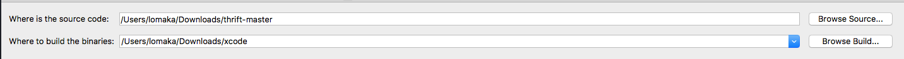
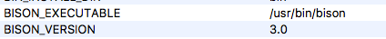
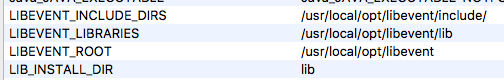
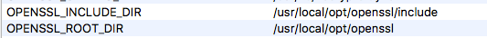
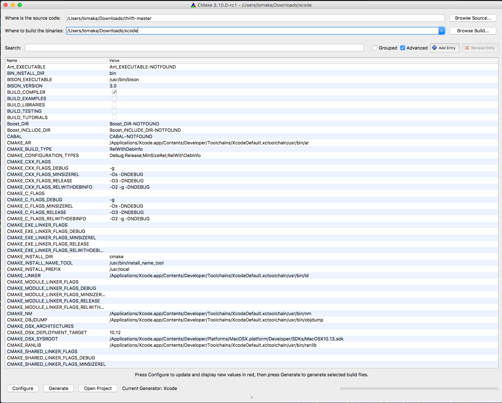
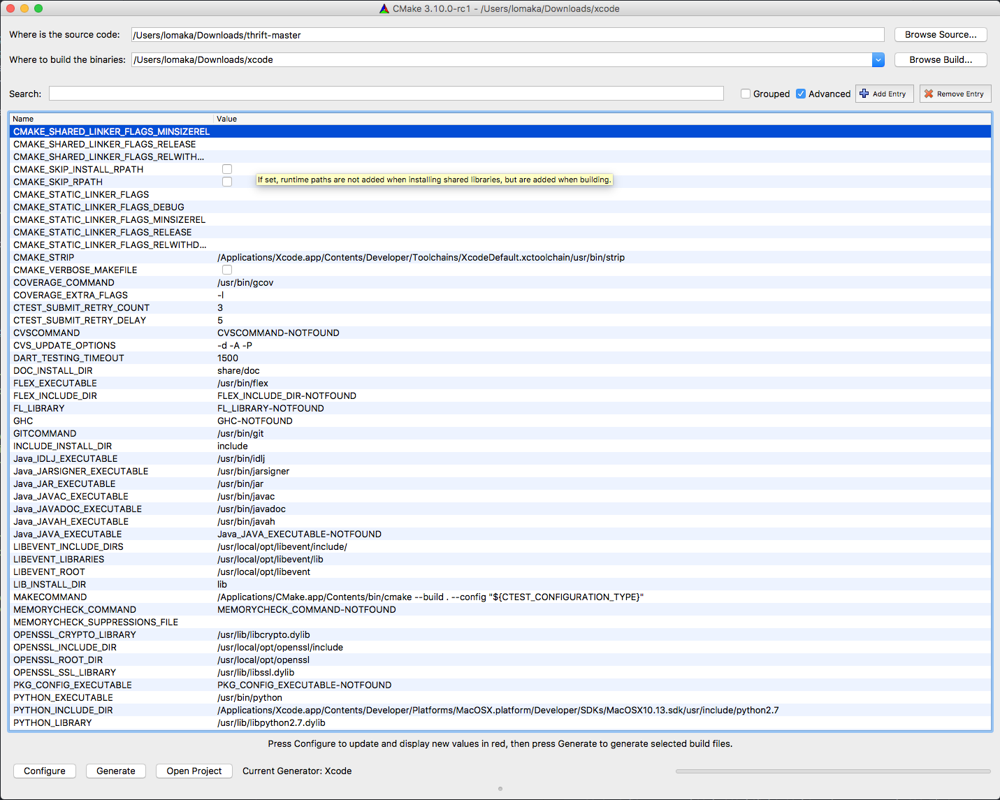
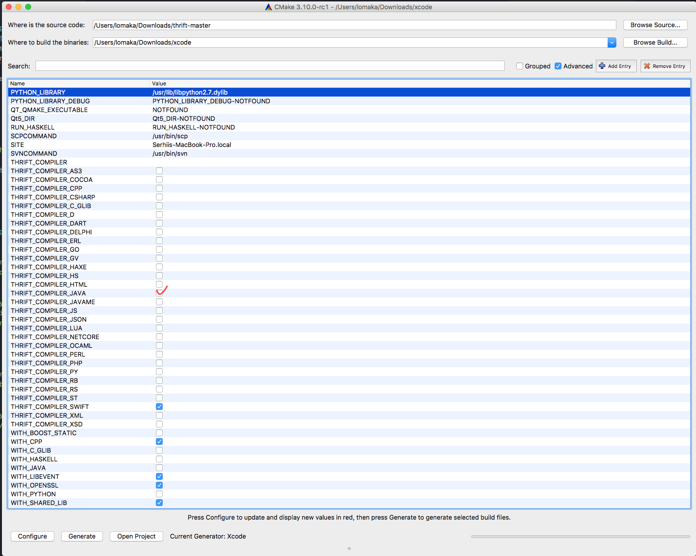
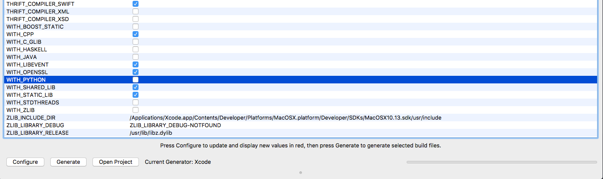

# Compile Thrift generator binary from sources for Swift 3/4 #
---
1. Install brew from [brew site](https://brew.sh).
2. Install cmake from [cmake site](https://cmake.org).
3. **Optional** Install JDK from [oracle site](http://www.oracle.com/technetwork/java/javase/downloads/jdk8-downloads-2133151.html). (my backed written on JAVA)
4. Install packages from brew:
  - openssl
  - libevent
  - bison
5. Clone repo [apocolipse/thrift](https://github.com/apocolipse/thrift)
6. Open Cmake app. Specify where thrift sources located and where to build you app (first image below).
7. Set variables for: (look images below)
  - openssl
  - libevent
  - bison
8. Generate Xcode project in Cmake app.
9. Open Xcode. Build schemes:
  - all_build
  - parse
  - thrift_compier
  - install
---
### Xcode errors: ###
```
.../thrift-master/compiler/cpp/src/thrift/thrifty.yy, invalid directive: `%code`
```
 Replace ```%code required { }``` with ```%{...%} ```

---
### Additional info: ###
#### Open SSL ####
##### OpenSSL cmake variables: #####
https://cmake.org/cmake/help/v3.0/module/FindOpenSSL.html

```
If you need to have this software first in your PATH run:
  echo 'export PATH="/usr/local/opt/openssl/bin:$PATH"' >> ~/.bash_profile
```
```
For compilers to find this software you may need to set:
LDFLAGS:  -L/usr/local/opt/openssl/lib
CPPFLAGS: -I/usr/local/opt/openssl/include
```

##### Bison #####
```
If you need to have this software first in your PATH run:
  echo 'export PATH="/usr/local/opt/bison/bin:$PATH"' >> ~/.bash_profile
```
```
For compilers to find this software you may need to set:
    LDFLAGS:  -L/usr/local/opt/bison/lib
```

#### Generate thrift file ####

`thrift --gen swift:async_clients,debug_descriptions -out ~/Desktop/ my_interface.thrift`

---
### Cmake images ###

 Thrift sources



##### Set this variables manualy  #####








##### General view of cmake variables for Swift  #####








